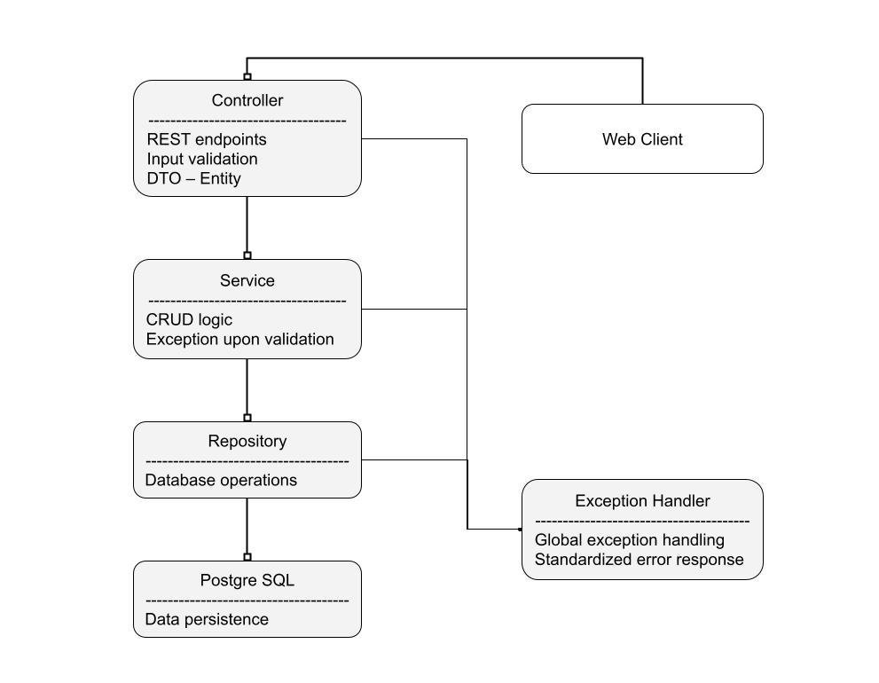
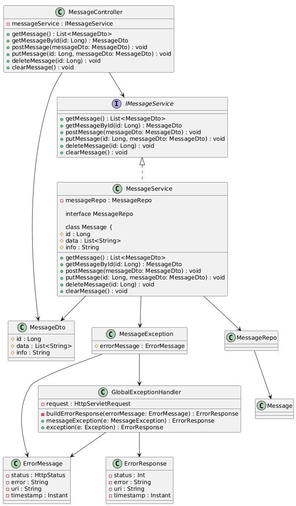

# Springboot Demo

## Table of Contents
- [Introduction](#introduction)
- [Overview](#overview)
- [Technical Stack](#technical-stack)
- [Features](#features)
- [User Guide](#user-guide)
- [Deployment Guide](#deployment-guide)

## Introduction

This is a Spring Boot application designed to demonstrate a layered architecture pattern in Java programming. The project uses a simple domain model to illustrate how responsibilities are separated across multiple layers to ensure loose coupling, maintainability, and scalability. 

It was developed as a reference implementation of:

- Interlayer data flows
- DTO mapping
- Exception handling
- Application containerization with Docker

## Overview

### System Architecture



### Class Diagram



### Layers

| Layer      | Responsibility                      |
|------------|-------------------------------------|
| Controller | Handles HTTP requests and responses |
| Service    | Provides business logic             |
| Repository | Handles database operations         |
| Database   | Persists structured data            |


## Technical Stack

| Technology      | Explanation                |
|-----------------|----------------------------|
| Java 8          |                            |
| Spring Boot     | Application framework      |
| Spring Web      | REST API                   |
| Spring Data JPA | ORM & database interaction |
| Hibernate       | JPA implementation         |
| Postgre SQL     | Database                   |
| Maven           | Dependency management      |
| Docker          | Containerization           |


## Features

### DTO Pattern

- Designated data transfer format from the frontend
- Separates internal entity from API contract

### Exception Handling
- Global exception handler
- Custom exception format
- Standardized error response


## User Guide

### Build and Run

- **Prerequisites**
  - JDK 1.8
  - Maven 3.6.x or above
  

- **Build Project**
```
mvn clean install
```

- **Build Project and skip tests**
```
mvn clean install -Dmaven.test.skip
```

- **Start Application**
```
mvn spring-boot:run
```

- **Run Unit Test**
```
mvn test
```

### API Endpoints
**Exposed port** `8085`

- **GET** `/msg`

  Returns a full list of messages

  **Sample Response**
  ```json
  [
      {
          "id": 0,
          "data": [
              "object0",
              "object1",
              "object2"
          ],
          "info": "sample0"
      },
      {
          "id": 1,
          "data": [
              "object3",
              "object4"
          ],
          "info": "sample1"
      }
  ]
  ```
  **Response Code**
  - 200 OK
  - 500 Internal Server Error
  

- **GET** `/msg/:id`

  Fetches a single message by ID

  **Sample Response**
  ```json
  {
      "id": 0,
      "data": [
          "object0",
          "object1",
          "object2"
      ],
      "info": "sample0"
  }
  ```
  **Response Code**
  - 200 OK
  - 400 Bad Request
  - 500 Internal Server Error


- **POST** `/msg`
  
  Creates a new message

  **Sample Request**
  ```json
  {
      "id": 0,
      "data": [
          "object0",
          "object1",
          "object2"
      ],
      "info": "sample0"
  }
  ```

  **Response Code**
  - 201 Created
  - 500 Internal Server Error


- **PUT** `/msg/:id`

  Updates provided fields of an existing message

  **Sample Request**
  ```json
  {
      "id": 0,
      "data": [
          "object0",
          "object1",
          "object2",
          "object5"
      ],
      "info": "sample0-modified"
  }
  ```
  **Response Code**
  - 200 OK
  - 400 Bad Request
  - 500 Internal Server Error


- **DELETE** `/msg/:id`

  Delete an existing message

  **Response Code**
  - 200 OK
  - 400 Bad Request
  - 500 Internal Server Error


- **DELETE** `/msg`

  Clears all messages

  **Response Code**
  - 200 OK
  - 500 Internal Server Error


## Deployment Guide

### Project Structure

<pre>
src/main/java/SpringbootDemo
├── controller
│   └── MessageController
├── service
│   ├── IMessageService
│   └── MessageService
├── repository
│   └── MessageRepo
├── entity
│   ├── Message
│   └── dto/MessageDto
├── exception
│   ├── MessageException
│   ├── ErrorMessage
│   ├── ErrorResponse
│   └── GlobalExceptionHandler
└── SpringbootDemoApplication
</pre>


### Database Schema

**JPA Entity Configuration**

```java
@Table(name="tb_msg")
@Entity
class Message {

    @Id
    @GeneratedValue(strategy = GenerationType.IDENTITY)
    @Column
    long id;

    @ElementCollection(targetClass = String.class, fetch = FetchType.EAGER)
    @CollectionTable(name = "tb_data", joinColumns = @JoinColumn(name = "msg_id"))
    @Column(nullable = false)
    List<String> data;

    @Column
    String info;
}
```

**SQL Schema**

```sql
CREATE TABLE tb_msg (
    id INT NOT NULL AUTO_INCREMENT,
    info VARCHAR(255),
    PRIMARY KEY (id)
);

CREATE TABLE tb_data (
    msg_id INT NOT NULL,
    data VARCHAR(255) NOT NULL,
    CONSTRAINT fk_msg
        FOREIGN KEY (msg_id)
        REFERENCES tb_msg(id)
        ON DELETE CASCADE
);
```


### Docker Deployment

- **Build Docker Image**
  ```
  docker build -t spring-demo .
  ```

- **Run Container**
  ```
  docker run -p 8085:8085 spring-demo
  ```
